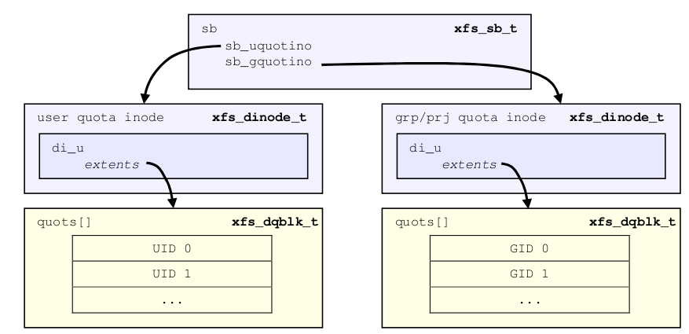

.. SPDX-License-Identifier: CC-BY-SA-4.0

Internal Inodes
---------------

XFS allocates several inodes when a filesystem is created. These are internal
and not accessible from the standard directory structure. These inodes are
only accessible from the superblock.

Quota Inodes
~~~~~~~~~~~~

Prior to version 5 filesystems, two inodes can be allocated for quota
management. The first inode will be used for user quotas. The second inode
will be used for group quotas or project quotas, depending on mount options.
Group and project quotas are mutually exclusive features in these
environments.

In version 5 or later filesystems, each quota type is allocated its own inode,
making it possible to use group and project quota management simultaneously.

-  Project quota’s primary purpose is to track and monitor disk usage for
   directories. For this to occur, the directory inode must have the
   XFS\_DIFLAG\_PROJINHERIT flag set so all inodes created underneath the
   directory inherit the project ID.

-  Inodes and blocks owned by ID zero do not have enforced quotas, but only
   quota accounting.

-  Extended attributes do not contribute towards the ID’s quota.

-  To access each ID’s quota information in the file, seek to the ID offset
   multiplied by the size of xfs\_dqblk\_t (136 bytes).

   Quota inode layout

Quota information is stored in the data extents of the reserved quota inodes
as an array of the xfs\_dqblk structures, where there is one array element for
each ID in the system:

.. code:: c

    struct xfs_disk_dquot {
         __be16                d_magic;
         __u8                  d_version;
         __u8                  d_flags;
         __be32                d_id;
         __be64                d_blk_hardlimit;
         __be64                d_blk_softlimit;
         __be64                d_ino_hardlimit;
         __be64                d_ino_softlimit;
         __be64                d_bcount;
         __be64                d_icount;
         __be32                d_itimer;
         __be32                d_btimer;
         __be16                d_iwarns;
         __be16                d_bwarns;
         __be32                d_pad0;
         __be64                d_rtb_hardlimit;
         __be64                d_rtb_softlimit;
         __be64                d_rtbcount;
         __be32                d_rtbtimer;
         __be16                d_rtbwarns;
         __be16                d_pad;
    };
    struct xfs_dqblk {
         struct xfs_disk_dquot dd_diskdq;
         char                  dd_fill[4];

         /* version 5 filesystem fields begin here */
         __be32                dd_crc;
         __be64                dd_lsn;
         uuid_t                dd_uuid;
    };

**d\_magic**
    Specifies the signature where these two bytes are 0x4451
    (XFS\_DQUOT\_MAGIC), or \`\`DQ'' in ASCII.

**d\_version**
    The structure version, currently this is 1 (XFS\_DQUOT\_VERSION).

**d\_flags**
    Specifies which type of ID the structure applies to:

.. code:: c

    #define XFS_DQ_USER  0x0001
    #define XFS_DQ_PROJ  0x0002
    #define XFS_DQ_GROUP 0x0004

**d\_id**
    The ID for the quota structure. This will be a uid, gid or projid based on
    the value of d\_flags.

**d\_blk\_hardlimit**
    The hard limit for the number of filesystem blocks the ID can own. The ID
    will not be able to use more space than this limit. If it is attempted,
    ENOSPC will be returned.

**d\_blk\_softlimit**
    The soft limit for the number of filesystem blocks the ID can own. The ID
    can temporarily use more space than by d\_blk\_softlimit up to
    d\_blk\_hardlimit. If the space is not freed by the time limit specified
    by ID zero’s d\_btimer value, the ID will be denied more space until the
    total blocks owned goes below d\_blk\_softlimit.

**d\_ino\_hardlimit**
    The hard limit for the number of inodes the ID can own. The ID will not be
    able to create or own any more inodes if d\_icount reaches this value.

**d\_ino\_softlimit**
    The soft limit for the number of inodes the ID can own. The ID can
    temporarily create or own more inodes than specified by d\_ino\_softlimit
    up to d\_ino\_hardlimit. If the inode count is not reduced by the time
    limit specified by ID zero’s d\_itimer value, the ID will be denied from
    creating or owning more inodes until the count goes below
    d\_ino\_softlimit.

**d\_bcount**
    How many filesystem blocks are actually owned by the ID.

**d\_icount**
    How many inodes are actually owned by the ID.

**d\_itimer**
    Specifies the time when the ID’s d\_icount exceeded d\_ino\_softlimit. The
    soft limit will turn into a hard limit after the elapsed time exceeds ID
    zero’s d\_itimer value. When d\_icount goes back below d\_ino\_softlimit,
    d\_itimer is reset back to zero.

**d\_btimer**
    Specifies the time when the ID’s d\_bcount exceeded d\_blk\_softlimit. The
    soft limit will turn into a hard limit after the elapsed time exceeds ID
    zero’s d\_btimer value. When d\_bcount goes back below d\_blk\_softlimit,
    d\_btimer is reset back to zero.

**d\_iwarns**; \ **d\_bwarns**; \ **d\_rtbwarns**
    Specifies how many times a warning has been issued. Currently not used.

**d\_rtb\_hardlimit**
    The hard limit for the number of real-time blocks the ID can own. The ID
    cannot own more space on the real-time subvolume beyond this limit.

**d\_rtb\_softlimit**
    The soft limit for the number of real-time blocks the ID can own. The ID
    can temporarily own more space than specified by d\_rtb\_softlimit up to
    d\_rtb\_hardlimit. If d\_rtbcount is not reduced by the time limit
    specified by ID zero’s d\_rtbtimer value, the ID will be denied from
    owning more space until the count goes below d\_rtb\_softlimit.

**d\_rtbcount**
    How many real-time blocks are currently owned by the ID.

**d\_rtbtimer**
    Specifies the time when the ID’s d\_rtbcount exceeded d\_rtb\_softlimit.
    The soft limit will turn into a hard limit after the elapsed time exceeds
    ID zero’s d\_rtbtimer value. When d\_rtbcount goes back below
    d\_rtb\_softlimit, d\_rtbtimer is reset back to zero.

**dd\_uuid**
    The UUID of this block, which must match either sb\_uuid or sb\_meta\_uuid
    depending on which features are set.

**dd\_lsn**
    Log sequence number of the last DQ block write.

**dd\_crc**
    Checksum of the DQ block.

Real-time Inodes
~~~~~~~~~~~~~~~~

There are two inodes allocated to managing the real-time device’s space, the
Bitmap Inode and the Summary Inode.

Real-Time Bitmap Inode
^^^^^^^^^^^^^^^^^^^^^^

The real time bitmap inode, sb\_rbmino, tracks the used/free space in the
real-time device using an old-style bitmap. One bit is allocated per real-time
extent. The size of an extent is specified by the superblock’s sb\_rextsize
value.

The number of blocks used by the bitmap inode is equal to the number of
real-time extents (sb\_rextents) divided by the block size (sb\_blocksize) and
bits per byte. This value is stored in sb\_rbmblocks. The nblocks and extent
array for the inode should match this. Each real time block gets its own bit
in the bitmap.

Real-Time Summary Inode
^^^^^^^^^^^^^^^^^^^^^^^

The real time summary inode, sb\_rsumino, tracks the used and free space
accounting information for the real-time device. This file indexes the
approximate location of each free extent on the real-time device first by
log2(extent size) and then by the real-time bitmap block number. The size of
the summary inode file is equal to sb\_rbmblocks × log2(realtime device size)
× sizeof(xfs\_suminfo\_t). The entry for a given log2(extent size) and
rtbitmap block number is 0 if there is no free extents of that size at that
rtbitmap location, and positive if there are any.

This data structure is not particularly space efficient, however it is a very
fast way to provide the same data as the two free space B+trees for regular
files since the space is preallocated and metadata maintenance is minimal.

.. include:: rtrmapbt.rst
