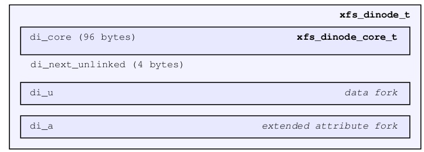
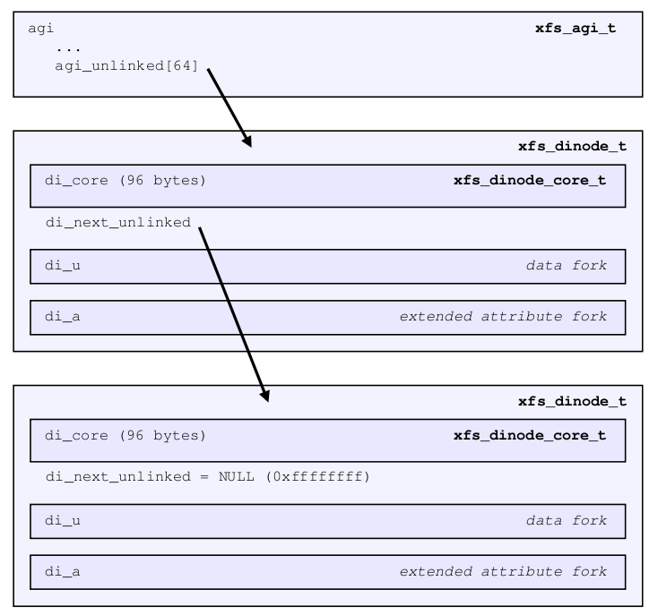
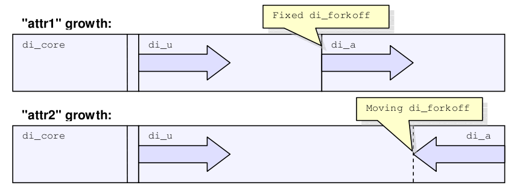

.. SPDX-License-Identifier: CC-BY-SA-4.0

On-Disk Inode
-------------

All files, directories, and links are stored on disk with inodes and descend
from the root inode with its number defined in the
`superblock <#superblocks>`__. The previous section on `AG Inode
Management <#ag-inode-management>`__ describes the allocation and management
of inodes on disk. This section describes the contents of inodes themselves.

An inode is divided into 3 parts:

   On-disk inode sections

-  The core contains what the inode represents, stat data, and information
   describing the data and attribute forks.

-  The di\_u "data fork" contains normal data related to the inode. Its
   contents depends on the file type specified by di\_core.di\_mode (eg.
   regular file, directory, link, etc) and how much information is contained
   in the file which determined by di\_core.di\_format. The following union to
   represent this data is declared as follows:

.. code:: c

    union {
         xfs_bmdr_block_t di_bmbt;
         xfs_bmbt_rec_t   di_bmx[1];
         xfs_dir2_sf_t    di_dir2sf;
         char             di_c[1];
         xfs_dev_t        di_dev;
         uuid_t           di_muuid;
         char             di_symlink[1];
    } di_u;

-  The di\_a "attribute fork" contains extended attributes. Its layout is
   determined by the di\_core.di\_aformat value. Its representation is
   declared as follows:

.. code:: c

    union {
         xfs_bmdr_block_t     di_abmbt;
         xfs_bmbt_rec_t       di_abmx[1];
         xfs_attr_shortform_t di_attrsf;
    } di_a;

-   The above two unions are rarely used in the XFS code, but the structures
    within the union are directly cast depending on the di\_mode/di\_format
    and di\_aformat values. They are referenced in this document to make it
    easier to explain the various structures in use within the inode.

The remaining space in the inode after di\_next\_unlinked where the two forks
are located is called the inode’s "literal area". This starts at offset
100 (0x64) in a version 1 or 2 inode, and offset 176 (0xb0) in a version 3
inode.

The space for each of the two forks in the literal area is determined by the
inode size, and di\_core.di\_forkoff. The data fork is located between the
start of the literal area and di\_forkoff. The attribute fork is located
between di\_forkoff and the end of the inode.

Inode Core
~~~~~~~~~~

The inode’s core is 96 bytes on a V4 filesystem and 176 bytes on a V5
filesystem. It contains information about the file itself including most stat
data information about data and attribute forks after the core within the
inode. It uses the following structure:

.. code:: c

    struct xfs_dinode_core {
         __uint16_t                di_magic;
         __uint16_t                di_mode;
         __int8_t                  di_version;
         __int8_t                  di_format;
         __uint16_t                di_onlink;
         __uint32_t                di_uid;
         __uint32_t                di_gid;
         __uint32_t                di_nlink;
         __uint16_t                di_projid;
         __uint16_t                di_projid_hi;
         __uint8_t                 di_pad[6];
         __uint16_t                di_flushiter;
         xfs_timestamp_t           di_atime;
         xfs_timestamp_t           di_mtime;
         xfs_timestamp_t           di_ctime;
         xfs_fsize_t               di_size;
         xfs_rfsblock_t            di_nblocks;
         xfs_extlen_t              di_extsize;
         xfs_extnum_t              di_nextents;
         xfs_aextnum_t             di_anextents;
         __uint8_t                 di_forkoff;
         __int8_t                  di_aformat;
         __uint32_t                di_dmevmask;
         __uint16_t                di_dmstate;
         __uint16_t                di_flags;
         __uint32_t                di_gen;

         /* di_next_unlinked is the only non-core field in the old dinode */
         __be32                    di_next_unlinked;

         /* version 5 filesystem (inode version 3) fields start here */
         __le32                    di_crc;
         __be64                    di_changecount;
         __be64                    di_lsn;
         __be64                    di_flags2;
         __be32                    di_cowextsize;
         __u8                      di_pad2[12];
         xfs_timestamp_t           di_crtime;
         __be64                    di_ino;
         uuid_t                    di_uuid;

    };

**di\_magic**
    The inode signature; these two bytes are "IN" (0x494e).

**di\_mode**
    Specifies the mode access bits and type of file using the standard S\_Ixxx
    values defined in stat.h.

**di\_version**
    Specifies the inode version which currently can only be 1, 2, or 3. The
    inode version specifies the usage of the di\_onlink, di\_nlink and
    di\_projid values in the inode core. Initially, inodes are created as v1
    but can be converted on the fly to v2 when required. v3 inodes are created
    only for v5 filesystems.

**di\_format**
    Specifies the format of the data fork in conjunction with the di\_mode
    type. This can be one of several values. For directories and links, it can
    be "local"
    where all metadata associated with the file is within the inode; "extents"
    where the inode contains an array of extents to other filesystem blocks
    which contain the associated metadata or data; or
    "btree" where the inode contains a B+tree
    root node which points to filesystem blocks containing the metadata or data.
    Migration between the formats depends on the amount of metadata associated with
    the inode. "dev" is used for character and block devices while
    "uuid" is
    currently not used.  "rmap" indicates that a reverse-mapping B+tree is
    rooted in the fork.

.. code:: c

    typedef enum xfs_dinode_fmt {
         XFS_DINODE_FMT_DEV,
         XFS_DINODE_FMT_LOCAL,
         XFS_DINODE_FMT_EXTENTS,
         XFS_DINODE_FMT_BTREE,
         XFS_DINODE_FMT_UUID,
         XFS_DINODE_FMT_RMAP,
    } xfs_dinode_fmt_t;

**di\_onlink**
    In v1 inodes, this specifies the number of links to the inode from
    directories. When the number exceeds 65535, the inode is converted to v2
    and the link count is stored in di\_nlink.

**di\_uid**
    Specifies the owner’s UID of the inode.

**di\_gid**
    Specifies the owner’s GID of the inode.

**di\_nlink**
    Specifies the number of links to the inode from directories. This is
    maintained for both inode versions for current versions of XFS. Prior to
    v2 inodes, this field was part of di\_pad.

**di\_projid**
    Specifies the owner’s project ID in v2 inodes. An inode is converted to v2
    if the project ID is set. This value must be zero for v1 inodes.

**di\_projid\_hi**
    Specifies the high 16 bits of the owner’s project ID in v2 inodes, if the
    XFS\_SB\_VERSION2\_PROJID32BIT feature is set; and zero otherwise.

**di\_pad[6]**
    Reserved, must be zero.

**di\_flushiter**
    Incremented on flush.

**di\_atime**
    Specifies the last access time of the files using UNIX time conventions
    the following structure. This value may be undefined if the filesystem is
    mounted with the "noatime" option. XFS supports timestamps with
    nanosecond resolution:

.. code:: c

    struct xfs_timestamp {
         __int32_t                 t_sec;
         __int32_t                 t_nsec;
    };

**di\_mtime**
    Specifies the last time the file was modified.

**di\_ctime**
    Specifies when the inode’s status was last changed.

**di\_size**
    Specifies the EOF of the inode in bytes. This can be larger or smaller
    than the extent space (therefore actual disk space) used for the inode.
    For regular files, this is the filesize in bytes, directories, the space
    taken by directory entries and for links, the length of the symlink.

**di\_nblocks**
    Specifies the number of filesystem blocks used to store the inode’s data
    including relevant metadata like B+trees. This does not include blocks
    used for extended attributes.

**di\_extsize**
    Specifies the extent size for filesystems with real-time devices or an
    extent size hint for standard filesystems. For normal filesystems, and
    with directories, the XFS\_DIFLAG\_EXTSZINHERIT flag must be set in
    di\_flags if this field is used. Inodes created in these directories will
    inherit the di\_extsize value and have XFS\_DIFLAG\_EXTSIZE set in their
    di\_flags. When a file is written to beyond allocated space, XFS will
    attempt to allocate additional disk space based on this value.

**di\_nextents**
    Specifies the number of data extents associated with this inode.

**di\_anextents**
    Specifies the number of extended attribute extents associated with this
    inode.

**di\_forkoff**
    Specifies the offset into the inode’s literal area where the extended
    attribute fork starts. This is an 8-bit value that is multiplied by 8 to
    determine the actual offset in bytes (ie. attribute data is 64-bit
    aligned). This also limits the maximum size of the inode to 2048 bytes.
    This value is initially zero until an extended attribute is created. When
    in attribute is added, the nature of di\_forkoff depends on the
    XFS\_SB\_VERSION2\_ATTR2BIT  flag in the superblock. Refer to `Extended
    Attribute Versions <#extended-attribute-versions>`__ for more details.

**di\_aformat**
    Specifies the format of the attribute fork. This uses the same values as
    di\_format, but restricted to "local", "extents" and "btree"
    formats for extended attribute data.

**di\_dmevmask**
    DMAPI event mask.

**di\_dmstate**
    DMAPI state.

**di\_flags**
    Specifies flags associated with the inode. This can be a combination of
    the following values:

.. list-table::
   :widths: 28 52
   :header-rows: 1

   * - Flag
     - Description

   * - XFS_DIFLAG_REALTIME
     - The inode's data is located on the real-time device.

   * - XFS_DIFLAG_PREALLOC
     - The inode's extents have been preallocated.

   * - XFS_DIFLAG_NEWRTBM
     - Specifies the +sb_rbmino+ uses the new real-time bitmap format

   * - XFS_DIFLAG_IMMUTABLE
     - Specifies the inode cannot be modified.

   * - XFS_DIFLAG_APPEND
     - The inode is in append only mode.

   * - XFS_DIFLAG_SYNC
     - The inode is written synchronously.

   * - XFS_DIFLAG_NOATIME
     - The inode's +di_atime+ is not updated.

   * - XFS_DIFLAG_NODUMP
     - Specifies the inode is to be ignored by xfsdump.

   * - XFS_DIFLAG_RTINHERIT
     - For directory inodes, new inodes inherit the XFS_DIFLAG_REALTIME bit.

   * - XFS_DIFLAG_PROJINHERIT
     - For directory inodes, new inodes inherit the ``di_projid`` value.

   * - XFS_DIFLAG_NOSYMLINKS
     - For directory inodes, symlinks cannot be created.

   * - XFS_DIFLAG_EXTSIZE
     - Specifies the extent size for real-time files or an extent size hint for
       regular files.

   * - XFS_DIFLAG_EXTSZINHERIT
     - For directory inodes, new inodes inherit the +di_extsize+ value.

   * - XFS_DIFLAG_NODEFRAG
     - Specifies the inode is to be ignored when defragmenting the filesystem.

   * - XFS_DIFLAG_FILESTREAMS
     - Use the filestream allocator.  The filestreams allocator allows a
       directory to reserve an entire allocation group for exclusive use by
       files created in that directory.  Files in other directories cannot use
       AGs reserved by other directories.

Table: Version 2 Inode flags

**di\_gen**
    A generation number used for inode identification. This is used by tools
    that do inode scanning such as backup tools and xfsdump. An inode’s
    generation number can change by unlinking and creating a new file that
    reuses the inode.

**di\_next\_unlinked**
    See the section on `unlinked inode pointers <#unlinked-pointer>`__ for
    more information.

**di\_crc**
    Checksum of the inode.

**di\_changecount**
    Counts the number of changes made to the attributes in this inode.

**di\_lsn**
    Log sequence number of the last inode write.

**di\_flags2**
    Specifies extended flags associated with a v3 inode.

.. list-table::
   :widths: 28 52
   :header-rows: 1

   * - Flag
     - Description

   * - XFS\_DIFLAG2\_DAX
     - For a file, enable DAX to increase performance on persistent-memory
       storage. If set on a directory, files created in the directory will
       inherit this flag.

   * - XFS\_DIFLAG2\_REFLINK
     - This inode shares (or has shared) data blocks with another inode.

   * - XFS\_DIFLAG2\_COWEXTSIZE
     - For files, this is the extent size hint for copy on write operations;
       see di\_cowextsize for details. For directories, the value in
       di\_cowextsize will be copied to all newly created files and
       directories.

Table: Version 3 Inode flags

**di\_cowextsize**
    Specifies the extent size hint for copy on write operations. When
    allocating extents for a copy on write operation, the allocator will be
    asked to align its allocations to either di\_cowextsize blocks or
    di\_extsize blocks, whichever is greater. The XFS\_DIFLAG2\_COWEXTSIZE
    flag must be set if this field is used. If this field and its flag are set
    on a directory file, the value will be copied into any files or
    directories created within this directory. During a block sharing
    operation, this value will be copied from the source file to the
    destination file if the sharing operation completely overwrites the
    destination file’s contents and the destination file does not already have
    di\_cowextsize set.

**di\_pad2**
    Padding for future expansion of the inode.

**di\_crtime**
    Specifies the time when this inode was created.

**di\_ino**
    The full inode number of this inode.

**di\_uuid**
    The UUID of this inode, which must match either sb\_uuid or sb\_meta\_uuid
    depending on which features are set.

Unlinked Pointer
~~~~~~~~~~~~~~~~

The di\_next\_unlinked value in the inode is used to track inodes that have
been unlinked (deleted) but are still open by a program. When an inode is in
this state, the inode is added to one of the `AGI’s <#ag-inode-management>`__
agi\_unlinked hash buckets. The AGI unlinked bucket points to an inode and the
di\_next\_unlinked value points to the next inode in the chain. The last inode
in the chain has di\_next\_unlinked set to NULL (-1).

Once the last reference is released, the inode is removed from the unlinked
hash chain and di\_next\_unlinked is set to NULL. In the case of a system
crash, XFS recovery will complete the unlink process for any inodes found in
these lists.

The only time the unlinked fields can be seen to be used on disk is either on
an active filesystem or a crashed system. A cleanly unmounted or recovered
filesystem will not have any inodes in these unlink hash chains.

   Unlinked inode pointer

Data Fork
~~~~~~~~~

The structure of the inode’s data fork based is on the inode’s type and
di\_format. The data fork begins at the start of the inode’s "literal area".
This area starts at offset 100 (0x64), or offset 176 (0xb0) in a v3 inode. The
size of the data fork is determined by the type and format. The maximum size is
determined by the inode size and di_forkoff. In code, use the XFS_DFORK_PTR
macro specifying XFS_DATA_FORK for the "which" parameter. Alternatively,
the XFS\_DFORK\_DPTR macro can be used.

Each of the following sub-sections summarises the contents of the data fork
based on the inode type.

Regular Files (S\_IFREG)
^^^^^^^^^^^^^^^^^^^^^^^^

The data fork specifies the file’s data extents. The extents specify where the
file’s actual data is located within the filesystem. Extents can have 2
formats which is defined by the di\_format value:

-  XFS\_DINODE\_FMT\_EXTENTS: The extent data is fully contained within the
   inode which contains an array of extents to the filesystem blocks for the
   file’s data. To access the extents, cast the return value from
   XFS\_DFORK\_DPTR to xfs\_bmbt\_rec\_t\*.

-  XFS\_DINODE\_FMT\_BTREE: The extent data is contained in the leaves of a
   B+tree. The inode contains the root node of the tree and is accessed by
   casting the return value from XFS\_DFORK\_DPTR to xfs\_bmdr\_block\_t\*.

Details for each of these data extent formats are covered in the `Data
Extents <#data-extents>`__ later on.

Directories (S\_IFDIR)
^^^^^^^^^^^^^^^^^^^^^^

The data fork contains the directory’s entries and associated data. The format
of the entries is also determined by the di\_format value and can be one of 3
formats:

-  XFS\_DINODE\_FMT\_LOCAL: The directory entries are fully contained within
   the inode. This is accessed by casting the value from XFS\_DFORK\_DPTR to
   xfs\_dir2\_sf\_t\*.

-  XFS\_DINODE\_FMT\_EXTENTS: The actual directory entries are located in
   another filesystem block, the inode contains an array of extents to these
   filesystem blocks (xfs\_bmbt\_rec\_t\*).

-  XFS\_DINODE\_FMT\_BTREE: The directory entries are contained in the leaves
   of a B+tree. The inode contains the root node (xfs\_bmdr\_block\_t\*).

Details for each of these directory formats are covered in the
`Directories <#directories>`__ later on.

Symbolic Links (S\_IFLNK)
^^^^^^^^^^^^^^^^^^^^^^^^^

The data fork contains the contents of the symbolic link. The format of the
link is determined by the di\_format value and can be one of 2 formats:

-  XFS\_DINODE\_FMT\_LOCAL: The symbolic link is fully contained within the
   inode. This is accessed by casting the return value from XFS\_DFORK\_DPTR
   to char\*.

-  XFS\_DINODE\_FMT\_EXTENTS: The actual symlink is located in another
   filesystem block, the inode contains the extents to these filesystem blocks
   (xfs\_bmbt\_rec\_t\*).

Details for symbolic links is covered in the section about `Symbolic
Links <#symbolic-links>`__.

Other File Types
^^^^^^^^^^^^^^^^

For character and block devices (S\_IFCHR and S\_IFBLK), cast the value from
XFS\_DFORK\_DPTR to xfs\_dev\_t\*.

Attribute Fork
~~~~~~~~~~~~~~

The attribute fork in the inode always contains the location of the extended
attributes associated with the inode.

The location of the attribute fork in the inode’s literal area is specified by
the di\_forkoff value in the inode’s core. If this value is zero, the inode
does not contain any extended attributes. If non-zero, the attribute fork’s
byte offset into the literal area can be computed from di\_forkoff × 8.
Attributes must be allocated on a 64-bit boundary on the disk. To access the
extended attributes in code, use the XFS\_DFORK\_PTR macro specifying
XFS\_ATTR\_FORK for the "which" parameter. Alternatively, the
XFS\_DFORK\_APTR macro can be used.

The structure of the attribute fork depends on the di\_aformat value in the
inode. It can be one of the following values:

-  XFS\_DINODE\_FMT\_LOCAL: The extended attributes are contained entirely
   within the inode. This is accessed by casting the value from
   XFS\_DFORK\_APTR to xfs\_attr\_shortform\_t\*.

-  XFS\_DINODE\_FMT\_EXTENTS: The attributes are located in another filesystem
   block, the inode contains an array of pointers to these filesystem blocks.
   They are accessed by casting the value from XFS\_DFORK\_APTR to
   xfs\_bmbt\_rec\_t\*.

-  XFS\_DINODE\_FMT\_BTREE: The extents for the attributes are contained in
   the leaves of a B+tree. The inode contains the root node of the tree and is
   accessed by casting the value from XFS\_DFORK\_APTR to
   xfs\_bmdr\_block\_t\*.

Detailed information on the layouts of extended attributes are covered in the
`Extended Attributes <#extended-attributes>`__ in this document.

Extended Attribute Versions
^^^^^^^^^^^^^^^^^^^^^^^^^^^

Extended attributes come in two versions: "attr1" or "attr2". The
attribute version is specified by the XFS\_SB\_VERSION2\_ATTR2BIT  flag in the
sb\_features2 field in the superblock. It determines how the inode’s extra
space is split between di\_u and di\_a forks which also determines how the
di\_forkoff value is maintained in the inode’s core.

With "attr1" attributes, the di\_forkoff is set to somewhere in the middle
of the space between the core and end of the inode and never changes (which
has the effect of artificially limiting the space for data information). As
the data fork grows, when it gets to di\_forkoff, it will move the data to the
next format level (ie. local < extent < btree). If very little space is used
for either attributes or data, then a good portion of the available inode
space is wasted with this version.

"attr2" was introduced to maximum the utilisation of the inode’s literal
area. The di\_forkoff starts at the end of the inode and works its way to the
data fork as attributes are added. Attr2 is highly recommended if extended
attributes are used.

The following diagram compares the two versions:

   Extended attribute layouts

Note that because di\_forkoff is an 8-bit value measuring units of 8 bytes,
the maximum size of an inode is 2\ :sup:`8` × 2\ :sup:`3` = 2\ :sup:`11` =
2048 bytes.
